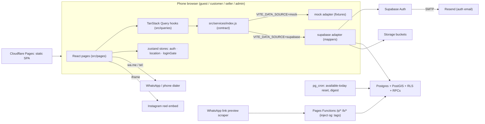

# 03 · Target architecture (JavaScript, continue-in-place)

## 1. System



## 2. Folders (end state)

```
src/
  main.jsx                   mounts <Providers><App/></Providers>
  App.jsx                    route table (LegacyPage shim shrinks, then disappears in B5.3)
  app/
    providers.jsx            QueryClientProvider, Toaster, AuthBootstrap
    ErrorBoundary.jsx        root error screen (no more white screens)
    guards.jsx               RequireAuth, RequireRole
  layouts/                   AppShell.jsx, BottomNav.jsx (kept)
  pages/
    home/  search/  category/  product/  business/
    auth/  profile/  saved/  enquiries/  notifications/
    seller/  admin/  static/  dev/ (dev-only UI gallery)
    NotFoundPage.jsx
  components/
    ui/                      Button, IconButton, Card, Badge, Chip, Input, Textarea, Select,
                             Switch, Tabs, Sheet, Dialog, Skeleton, Spinner, EmptyState,
                             ErrorState, PageHeader, Avatar, ImagePlaceholder
    brand/Logo.jsx
    ProductCard, BusinessCard, Price, Rating, Distance, SectionHeader, CategoryChips,
    HorizontalScroller, ImageGallery, ReelEmbed, ContactButtons, SaveButton,
    LocationChip, AreaPickerSheet, LoginSheet, EnquirySheet, ReviewSheet, ...
  queries/                   keys.js, catalog.js, me.js, saved.js, activity.js, contact.js,
                             seller.js, admin.js, enquiries.js, notifications.js, reviews.js
  stores/                    auth.js, location.js, loginGate.js
  services/
    index.js                 adapter switch — the only import pages' hooks use
    contract.js              FUNCTION_NAMES + JSDoc typedefs (mirrors docs/CONTRACT.md)
    errors.js                AppError
    mock/                    index.js, fixtures.js, taxonomy.js, data/ (raw legacy data)
    supabase/                client.js, mappers.js, catalog.js, auth.js, me.js, contact.js,
                             saved.js, activity.js, seller.js, admin.js, enquiries.js,
                             notifications.js, reviews.js, index.js
  lib/                       format.js, whatsapp.js, instagram.js, geo.js, image.js,
                             categoryIcons.js, storage.js (safe localStorage helpers)
  styles/theme.css           tokens (kept)
functions/p/[id].ts, functions/b/[slug].ts   OG tag injection (TypeScript OK)
supabase/                    migrations/, cron.sql, tests/ (from the dev kit)
scripts/                     check-guards.mjs, legacy-allowlist.json, seed-dev.mjs
docs/                        CONTRACT.md, DECISIONS.md, PROGRESS.md, PHASE2_BACKLOG.md,
                             build/ (this kit), kit/ (dev kit docs 01–09)
```

## 3. Routes (end state)

| Path | Page | Access | BottomNav |
|---|---|---|---|
| `/` | HomePage | public | yes |
| `/search` (`?q=&tab=&cat=&today=&sort=&min=&max=`) | SearchPage | public | yes |
| `/category/:slug` (`?sub=&tab=&sort=&today=`) | CategoryPage | public | yes |
| `/p/:productId` | ProductPage | public | hidden |
| `/b/:slug` (`?tab=products\|videos\|reviews`) | BusinessPage | public | hidden |
| `/login` `/signup` (`?as=seller&next=`) `/forgot-password` `/reset-password` `/auth/callback` | auth pages | guest | hidden |
| `/profile` | ProfilePage (guest sees login CTA) | public | yes |
| `/profile/edit` `/saved` `/recent` `/connected` | profile area | customer+ | yes |
| `/enquiries` `/enquiries/:threadId` | customer inbox / thread | customer+ | list yes, thread hidden |
| `/notifications` `/notifications/settings` | notifications | customer+ | yes |
| `/sell` | seller landing | public | yes |
| `/seller/onboarding` | wizard | seller | hidden |
| `/seller` `/seller/products` `/seller/products/new` `/seller/products/:id` `/seller/videos` `/seller/business` `/seller/enquiries` `/seller/enquiries/:threadId` `/seller/reviews` | seller area | seller (admin allowed) | hidden |
| `/admin` `/admin/applications/:businessId` | admin panel | admin | hidden |
| `/about` `/privacy` `/terms` `/help` | static | public | yes |
| `/dev/ui` | component gallery | dev builds only | hidden |
| `*` | NotFoundPage | public | yes |

BottomNav `HIDDEN_PREFIXES`: `/p/`, `/b/`, `/login`, `/signup`, `/forgot-password`, `/reset-password`, `/auth/`, `/enquiries/`, `/seller`, `/admin`, `/dev/`.

## 4. Key flows

**Contact a seller (SOW core).** ContactButtons → `useContactAction().start('whatsapp', { business, product })` → guest? `loginGate.request()` → LoginSheet → login/signup (pending action saved in localStorage) → on `authenticated`, the gate replays the action → `revealContact()` (RPC checks auth, rate-limits, logs `contact_events`) → `whatsappLink(number, productMessage(product, siteUrl))` → `window.location.href = link` (not `window.open`; iOS blocks pop-ups after an `await`).

**Link preview.** Seller receives `https://<domain>/p/<uuid>` → WhatsApp's scraper requests it → Pages Function fetches the approved product with the anon key → injects `og:title`, `og:description`, `og:image`, `og:url` into `index.html` → returns it; real browsers get the same HTML and the SPA boots.

**Seller approval.** Onboarding saves a `draft` business step by step → submit (RPC validates the checklist → `pending`) → admin panel → `admin_set_business_status` (approve / reject with reason / unpublish) → trigger writes a notification → RLS makes `approved` rows public.

## 5. Legacy replacement map

| Legacy file(s) | Replaced by | Task |
|---|---|---|
| `Offers.jsx`, `OfferDetails.jsx`, `Discover.jsx`, `Addresses.jsx`, `AddAddress.jsx`, `services/offerService.js` | removed (Phase 2) | B1.3 |
| `services/*Service.js`, `services/types.js`, `services/mock/normalize.js`, `utils/distance.js` | `services/index.js` + adapters, `lib/format.js`, `lib/geo.js` | B1.4 (new) → deleted B2.4 |
| `hooks/useAsync.js` | TanStack Query hooks | B1.5 (new) → deleted B5.3 |
| `Product.jsx` | `pages/product/ProductPage.jsx` | B1.7 |
| `Business.jsx` | `pages/business/BusinessPage.jsx` | B1.8 |
| `legacy/components/brand/Logo.jsx` | `components/brand/Logo.jsx` | B1.6 |
| `Home.jsx` | `pages/home/HomePage.jsx` | B2.1 |
| `Desserts, Crochet, Resin, Candles, Embroidery, Jewellery, WomenFashion, MenFashion, Gifts, Fashion, Handmade .jsx` | `pages/category/CategoryPage.jsx` | B2.2 |
| `Search.jsx`, `legacy/components/SearchBar.jsx` | `pages/search/SearchPage.jsx` | B2.3 |
| `ProductsViewAll`, `BusinessViewAll`, `ReelsViewAll`, `Reel.jsx` | links to `/search?…` / `/category/…`; videos live on Business page | B2.4 |
| `AboutTibu`, `PrivacySecurity`, `HelpFeedback`, `TermsConditions`, `legacy/pages/NotFound.jsx` | `pages/static/*`, `pages/NotFoundPage.jsx` | B2.4 |
| `Profile.jsx`, `EditProfile.jsx`, `contexts/ProfileContext.jsx` | `pages/profile/*`, auth + me queries | B3.4 |
| `Saved.jsx`, `contexts/SavedContext.jsx`, `legacy/components/*Card.jsx`, `Banner.jsx` | `pages/saved/*`, saved queries, new cards | B3.5 |
| `SellerRegister.jsx` | `pages/seller/onboarding/*` | B4.2 |
| `SellerDashboard.jsx`, `SellerProductDetail.jsx` | `pages/seller/*` | B4.3 |
| `legacy/pages/Notification.jsx`, `NotificationPreferences.jsx`, `LegacyPage` in `App.jsx`, `hooks/useSetPage.js` | `pages/notifications/*` | B5.3 |

When B5.3 merges, `src/legacy/`, `src/contexts/`, `src/hooks/` and the allowlist are empty. Delete the allowlist entries as you go; the guard warns about stale ones.

## 6. Environments

| | Local | Preview (every branch) | Production |
|---|---|---|---|
| Frontend | `npm run dev` | Cloudflare Pages branch preview | Pages production branch `main`, client's domain |
| Data | `mock` (default) or dev Supabase | `tibu-dev` (from A2.1) | `tibu-prod` (A5.2) |
| Seed data | yes (dev) | yes (dev) | **never** — real sellers only |
| Auth redirect URLs | `http://localhost:5173/**` | `https://*.<project>.pages.dev/**` | `https://<domain>/**` |
