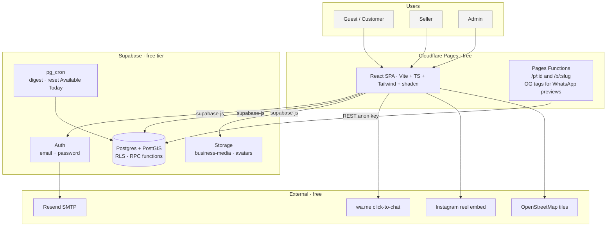
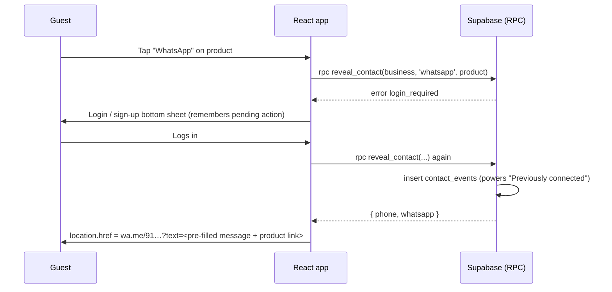
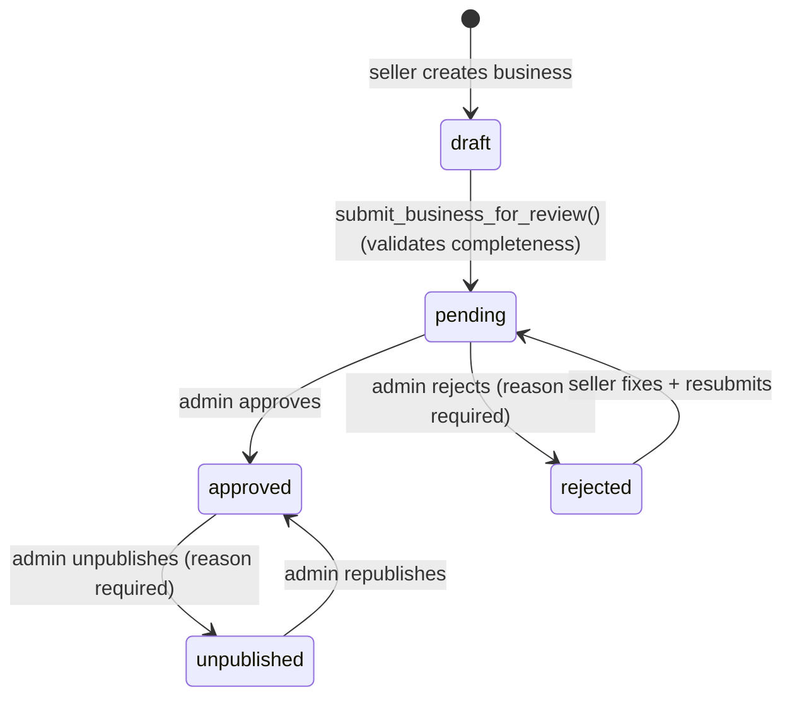

# 02 · System Architecture

## 1. Overview

**One app, three roles.** Customer, seller and admin screens live in the same React app under different routes. Role checks in the UI are for UX only. Real enforcement is RLS in the database.

## 2. Components

> Free-tier limits change. Re-check each vendor's pricing page before launch and note the numbers in the handover doc.

| Component | Tech | Responsibility | Free-tier limits to watch |
|---|---|---|---|
| Web app | React 19, Vite, TypeScript, React Router, TanStack Query, Zustand, Tailwind, shadcn/ui, react-hook-form + zod | All UI, routing, client state, calls Supabase | — |
| Hosting | Cloudflare Pages | Static hosting, SPA fallback, preview deploys per branch, Pages Functions | 500 builds/month, 100k function requests/day |
| OG functions | Cloudflare Pages Functions (Workers runtime) | Serve per-product / per-business `<meta og:*>` so WhatsApp shows the image | Same as above |
| Database | Supabase Postgres 15+ with PostGIS, pg_trgm | Data, constraints, RLS, RPC business logic, triggers | 500 MB DB, pauses when idle |
| Auth | Supabase Auth | Email/password signup, login, password reset, sessions (JWT) | 50k MAU |
| Storage | Supabase Storage | Logos, banners, gallery, product photos, avatars | 1 GB storage; egress shared with plan quota |
| Jobs | pg_cron | Daily digest notifications, reset Available Today, cleanup | — |
| Email | Resend (custom SMTP in Supabase) | Confirm-email, reset-password | 3,000/month, 100/day |
| Maps | Leaflet + OSM tiles | Seller location pin-picker only | OSM tile policy: fair use, attribution required |
| Monitoring | Sentry (free) | Frontend errors | 5k errors/month |

## 3. Key flows

### 3.1 Guest → contact seller (login gate)

### 3.2 Seller onboarding → admin approval

Only `approved` businesses (and their active products, images, videos, reviews) are visible to the public. The seller always sees their own business in any state.

### 3.3 Enquiry (non-real-time)

1. Customer writes a message on a Business/Product page → `rpc send_enquiry` creates or reuses the thread (one per customer+business) and inserts the message.
2. Trigger `tg_enquiry_message_after` bumps `last_message_at` and inserts a `notifications` row for the seller.
3. Seller dashboard shows an unread badge (`rpc unread_counts`, polled every 60 s + on focus).
4. Seller replies (direct insert into `enquiry_messages`, allowed by RLS) → trigger notifies the customer.
5. Opening a thread calls `rpc mark_enquiry_read`, which clears message and notification unread flags.

### 3.4 Link preview for the WhatsApp message

`https://tibu.in/p/<product-id>` is handled by `functions/p/[id].ts`: it fetches the product via the public REST API, injects `og:title` / `og:image` into `index.html`, and returns it. WhatsApp's crawler reads the tags → the seller sees the product photo in the chat. Human visitors get the same HTML and the SPA boots normally.

## 4. Security model

| Layer | Control |
|---|---|
| Transport | HTTPS everywhere (Cloudflare + Supabase) |
| Identity | Supabase Auth JWT; `auth.uid()` in every policy |
| Authorization | RLS on all 17 tables (`0003_rls_policies.sql`). Privileged operations only via SECURITY DEFINER RPCs that check the caller |
| Role escalation | `profiles.role` can't be changed by users (trigger `profiles_guard`). Signup metadata can only choose `customer` or `seller`; admins are promoted by SQL |
| Seller self-approval | `businesses_guard` freezes `status`, ratings, approval fields for non-privileged updates |
| Contact privacy | Phones live in `business_contacts` (no public read). Revealed only via `reveal_contact`, which requires login, logs the event and rate-limits (60/hour) |
| Abuse | Enquiry rate limit (20 messages/hour/user), storage MIME + size limits, review uniqueness |
| Secrets | Only the anon key is in the frontend. Service role key never leaves CI/scripts |
| Input | DB `check` constraints (lengths, phone regex, price range) + zod on the client |

## 5. Environments

| Env | Frontend | Supabase project | Data |
|---|---|---|---|
| Local | `npm run dev` | `supabase start` (Docker) or the dev project | Fake |
| Dev / preview | Cloudflare preview URL per branch | `tibu-dev` | Fake, resettable |
| Production | `tibu.in` (client's domain) | `tibu-prod` | Real only — never seed demo businesses |

Supabase free allows 2 active projects, exactly dev + prod.

## 6. Scaling path (Phase 2)

1. Supabase Pro ($25/mo): no pausing, daily backups, 8 GB DB, image transformations.
2. Move images to Cloudinary or enable Supabase image transforms for thumbnails.
3. Realtime chat: switch enquiry polling to Supabase Realtime subscriptions (schema already fits).
4. Payments/orders: new `orders`, `order_items`, `payments` tables referencing `products` and `profiles`.
5. Web push notifications via a service worker (the `notifications` table is already the source).
