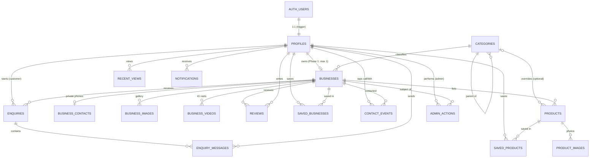

# 03 · Data Model & Entity Relationships

Source of truth: `supabase/migrations/20260925000001_init_schema.sql`. If this doc and the SQL disagree, the SQL wins. Update this doc in the same PR.

## 1. Entity-relationship diagram

## 2. Relationship rules (in plain words)

| Relationship | Cardinality | Enforced by | On delete |
|---|---|---|---|
| auth user → profile | exactly 1 | `handle_new_user` trigger, PK = FK | cascade |
| profile → business | 0 or 1 (Phase 1) | `businesses.owner_id UNIQUE` | cascade |
| category → subcategories | 0..n, max 2 levels by convention | `categories.parent_id` | restrict |
| business → contacts | 0 or 1 (required to submit) | PK = FK | cascade |
| business → products / images / videos | 0..n | FK | cascade |
| product → images | 0..n, first by `sort_order` is the cover | FK | cascade |
| customer → review of a business | max 1 per business, not own business | `UNIQUE(business_id, user_id)` + RLS | cascade |
| customer ↔ saved business/product | many-to-many | composite PK | cascade |
| customer → recent views | max 50 kept, each row is exactly one of business/product | `CHECK num_nonnulls = 1` + `track_view` | cascade |
| customer → contact events | append-only log | insert only via `reveal_contact` | cascade (product: set null) |
| customer ↔ business enquiry thread | max 1 thread per pair | `UNIQUE(customer_id, business_id)` | cascade |
| thread → messages | 0..n | FK | cascade |

## 3. Tables

Legend: 🔒 = not publicly readable · ⚙ = system-managed (clients can't write)

### profiles
| Column | Type | Notes |
|---|---|---|
| id | uuid PK → auth.users | |
| role ⚙ | enum customer/seller/admin | set at signup from `signup_as`; changed only via `become_seller()` or SQL |
| full_name | text ≤80 | |
| phone | text | optional, 10-digit Indian mobile |
| avatar_url | text | Storage `avatars/{uid}/…` |
| home_locality, home_lat, home_lng | text, float, float | used for digest + default search origin |
| home_location ⚙ | geography(Point) | from lat/lng by trigger |
| notify_digest | bool, default true | customer opt-out of grouped updates |
| created_at, updated_at ⚙ | timestamptz | |

### categories
`id`, `slug` (unique, kebab-case), `name`, `parent_id`, `icon`, `sort_order`, `is_active`. Seeded in `0006` — six top-level categories and six subcategories (Handmade → Crochet/Embroidery/Resin Art/Candles; Fashion → Women's/Men's). Searching a parent slug includes its children (`category_ids()`).

### businesses
| Column | Type | Notes |
|---|---|---|
| id | uuid PK | |
| owner_id ⚙ | uuid → profiles, UNIQUE | |
| slug | text unique | public URL `/b/:slug`; generate from name + short suffix on create |
| name, description | text | 2–80 / ≤2000 chars |
| category_id | → categories | required to submit |
| logo_url, banner_url | text | required logo to submit |
| instagram_handle | text | admin verification; required to submit |
| address_text, locality, city | text | city defaults Mumbai |
| lat, lng | float | **what the app writes** |
| location ⚙ | geography(Point,4326) | **what search uses**; trigger-maintained |
| delivery_available, pickup_available | bool | |
| available_today, available_today_at ⚙ | bool, timestamptz | manual toggle; reset nightly by cron (confirm) |
| status ⚙ | enum draft/pending/approved/rejected/unpublished | only RPCs change it |
| rejection_reason ⚙ | text | shown to seller |
| rating_avg ⚙, rating_count ⚙ | numeric(2,1), int | trigger from reviews |
| submitted_at ⚙, approved_at ⚙, approved_by ⚙ | | |

### business_contacts 🔒
`business_id` (PK/FK), `phone`, `whatsapp` (10-digit, `^[6-9]\d{9}$`). Readable only by the owner and admins. Customers get it via `reveal_contact()`.

### business_images · product_images
`id`, parent FK, `storage_path`, `url`, `sort_order`. Lowest `sort_order` = cover.

### business_videos
`id`, `business_id`, `instagram_url` (as pasted), `shortcode` (parsed; unique per business), `caption`, `sort_order`.

### products
| Column | Type | Notes |
|---|---|---|
| id | uuid PK | public URL `/p/:id` |
| business_id | → businesses | |
| name | 2–100 chars | |
| price_paise | int ≥0 | **₹350 = 35000.** Never store strings |
| description | ≤2000 | |
| details | jsonb | free-form key/values shown as "Product details" (weight, size, material…) |
| category_id | nullable | null = inherit business category |
| available_today (+ `_at` ⚙), is_active, sort_order | | inactive = hidden from public |

### reviews
`id`, `business_id`, `user_id` ⚙ (forced to caller), `reviewer_name` ⚙ (first name snapshot), `rating` 1–5, `body` ≤1000, timestamps. Unique per (business, user). Sellers can't review their own business.

### saved_businesses · saved_products
Composite PK (user, item), `created_at`. Owner-only.

### recent_views
`id`, `user_id`, `business_id` xor `product_id`, `viewed_at`. Write via `track_view()` only. Guests use localStorage (merge on login).

### contact_events
`id`, `user_id`, `business_id`, `product_id?`, `channel` whatsapp/call, `created_at`. Insert only via `reveal_contact()`. Feeds "Previously connected" and seller basic figures.

### enquiries · enquiry_messages
Thread: `id`, `customer_id`, `business_id`, `product_id?` (context), `status` open/closed, `last_message_at` ⚙. Message: `id`, `enquiry_id`, `sender_id`, `body` 1–2000, `created_at`, `read_at`.

### notifications
`id`, `user_id`, `type` (enum), `title`, `body`, `link` (in-app route), `payload` jsonb, `read_at`, `created_at`. Created only by triggers/RPCs/cron. Clients may only set `read_at` (column-level grant).

| type | Recipient | Created by |
|---|---|---|
| enquiry_new | seller | message trigger |
| enquiry_reply | customer | message trigger |
| business_approved / rejected / unpublished | seller | `admin_set_business_status` |
| review_new | seller | review trigger |
| digest_new_businesses | customer | `job_new_business_digest` (cron) |

### admin_actions 🔒
Audit log of approve/reject/unpublish/republish with reason. Admin-read only.

## 4. Mapping from the prototype's static data

| Prototype field (audit §3) | New home |
|---|---|
| `price: "₹899"` | `products.price_paise = 89900` |
| `distance: "2 km"` | computed `distance_m` from RPC → `formatDistance()` |
| `rating: "4.9"`, `businessReviews: "320 Reviews"` | `businesses.rating_avg`, `rating_count` |
| `emoji` as image | real `*_images.url`; emoji kept only as `categories.icon` |
| `businessId: "Whisk-Wonders"` | `businesses.slug` lowercase kebab; PK is uuid |
| product `businessName`, `location`, `delivery` copies | join to `businesses` (no duplication) |
| reels R-short / R-full | `business_videos` (one shape) |
| review `rating: "⭐⭐⭐⭐⭐"` | `reviews.rating` smallint; stars rendered in UI |
| `page: "desserts"` | route `/category/desserts` |
| `availableToday` | `products.available_today` / `businesses.available_today` |
| Offers, Discover feed, saved reels | **Not in Phase 1** (Phase 2 per SOW §4) — remove from UI |

## 5. Deliberate Phase 1 simplifications

- One business per seller (`UNIQUE owner_id`). Drop the constraint in Phase 2 for multi-shop sellers.
- Editing an approved business does **not** send it back to review. Admin can unpublish if needed. Confirm with client.
- No offers/coupons tables (not in SOW Phase 1).
- Search uses `ILIKE` + trigram indexes. Good for thousands of rows; move to full-text search if the catalog grows large.
