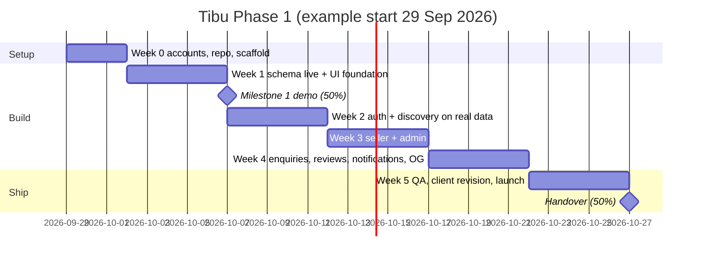

# 07 · Roadmap & Step-by-Step Build Plan

**Capacity:** 2 people × weekdays 6–10 PM ≈ 20 h/person/week → ~160–200 h total over 4–5 weeks.
**Split:** **A = backend/data/integrations** (Supabase, SQL, functions, deploy) · **B = frontend/UI** (screens, components, UX). Both review each other's PRs.

## Roadmap at a glance

| Week | Goal | Exit check (demo this) |
|---|---|---|
| 0 | Everything set up, empty app deployed | Preview URL loads the app shell |
| 1 | DB live; new UI foundation with all public screens on mock data | **Milestone 1:** refined UI, audit bugs closed (see `05` §8) |
| 2 | Real auth + real discovery | Guest browses nearby real data; login gate works; saved/recent |
| 3 | Seller + admin | Seller onboards → admin approves → business goes live |
| 4 | Enquiries, reviews, notifications, link previews | Every SOW feature works end to end |
| 5 | QA, client revision round, prod launch, handover | Live on client domain; handover pack delivered |

**Cut order if behind** (tell the client when you cut — SOW §12): 1) daily digest, 2) DB-synced recently viewed (keep localStorage), 3) review editing, 4) gallery images (keep logo + banner), 5) seller stats cards.

---

## Week 0 — Setup (2–3 evenings)

**A — accounts & backend**
1. Ask the client to create (or share access to): domain, Cloudflare account, Supabase org, Resend account, GitHub org. Accounts in the client's name (SOW §11).
2. Create Supabase projects `tibu-dev` and `tibu-prod` (region: Mumbai `ap-south-1`). Save DB passwords in a shared password manager.
3. Install tools: `npm i -g supabase` (or `npx supabase`), Docker Desktop for local.
4. In the repo: `npx supabase init`, copy `supabase/migrations/*` from this kit, `npx supabase link --project-ref <dev-ref>`, `npx supabase db push`.
5. Dashboard → Database → Extensions → enable **pg_cron**; run `supabase/cron.sql` in the SQL editor (dev).
6. Run `supabase/tests/rls_smoke_test.sql` against dev → all OK notices. Then delete the test users (Auth → Users).
7. Auth settings (dev): Site URL = preview URL; redirect URLs `http://localhost:5173/**`, `https://*.tibu.pages.dev/**`.

**B — frontend scaffold**
1. `npm create vite@latest tibu -- --template react-ts` → move legacy app to `legacy/` (read-only reference).
2. Install: `react-router-dom @tanstack/react-query zustand @supabase/supabase-js react-hook-form zod @hookform/resolvers lucide-react sonner browser-image-compression leaflet react-leaflet`.
3. Tailwind 4 + `npx shadcn@latest init`; add components: button, input, textarea, sheet, dialog, tabs, card, badge, skeleton, toast/sonner, select, switch, avatar, dropdown-menu, form, label, separator, scroll-area.
4. Path alias `@/` in `vite.config.ts` + `tsconfig`. Copy `snippets/src/lib/*` into `src/lib/`. Copy `snippets/.env.example`, create `.env.local`.
5. `npm run gen:types` → `src/types/database.ts`.
6. App shell: `router.tsx` with all routes as placeholders, `AppShell` + `BottomNav` with per-route visibility, design tokens in `globals.css`.
7. Cloudflare Pages: connect repo, build `npm run build`, output `dist`, env vars `VITE_*`. Push → preview URL.
8. Add `AGENTS.md` (from this kit) at repo root + `.cursor/rules` pointing to it.

✅ **Exit:** preview URL shows the shell; `db push` succeeded; types generated.

## Week 1 — Foundation + Milestone 1

**A**
- Write `src/api/*` functions + hooks for catalog, business, product, search (against the real DB; empty is fine).
- Build a **dev seed script** (`scripts/seed-dev.ts`, uses service role key locally only) that creates 3 fake sellers, 12 businesses around Mumbai, 40 products with placeholder images, so B has realistic data. Never run on prod.
- Auth email: set up Resend, verify domain (DNS on client's domain), plug SMTP into Supabase Auth (dev + prod). Customise email templates (Tibu branding).

**B**
- Components: ProductCard, BusinessCard, Rating, Price, Distance, SkeletonCard, EmptyState, ErrorState, SaveButton (UI only), ContactButtons (UI only), ImageGallery, ReelEmbed.
- Pages: Home, Search (+ filters sheet, URL state), CategoryPage, Business (3 tabs), Product, 404 — wired to hooks (dev seed data).
- Remove Phase-2 screens from nav (Discover, Offers, address book).
- Mobile QA pass at 360 / 390 / 430 px widths.

✅ **Milestone 1 demo:** walk the client through the new UI on a phone + the bug-resolution table (`05` §8). Invoice 50%.

## Week 2 — Auth & real discovery

**A**
- Location store + `geo.ts`; pass lat/lng into search hooks.
- `reveal_contact` integration helper, `track_view`, saved APIs, recently-viewed merge on login.
- Error-code mapping (`rpcErrorCode`) + global toast handler.

**B**
- Auth pages: login, signup, forgot, reset, callback; `LoginSheet` + login-gate store with resume.
- Location prompt + area picker sheet; location chip on Home.
- ContactButtons live (WhatsApp/Call with pre-filled message).
- Profile, Edit profile, Saved (2 tabs), Recently viewed, Previously connected.

✅ **Exit:** incognito → browse nearby → tap WhatsApp → sign up → WhatsApp opens with the right message → appears in "Previously connected".

## Week 3 — Seller & admin

**A**
- `image-upload.ts` integrated; storage paths verified against policies.
- Seller APIs: create business (slug generator), contacts upsert, products CRUD, images, videos, submit, stats.
- Admin APIs: list, decide, history.
- Test RLS as: guest, customer, seller A, seller B (can't touch A's data), admin.

**B**
- `/sell` landing; seller signup; `become_seller` path.
- Onboarding wizard (7 steps, autosave, LocationPicker, ImageUploader, product form, reel links, submit checklist).
- Seller home (status banner, stats, Available Today toggle), products list/form, videos, edit business.
- Admin panel: tabs, list, detail preview, approve/reject/unpublish dialogs with reason.

✅ **Exit:** new seller account → full onboarding → submit → admin approves → business appears on Home/Search for a guest.

## Week 4 — Enquiries, reviews, notifications, previews

**A**
- Deploy `functions/p/[id].ts` and `functions/b/[slug].ts`; set Pages env vars; test previews in WhatsApp.
- Confirm cron jobs run in dev (`cron.job_run_details`).
- Sentry setup (frontend). Uptime/keep-alive workflow (see `08`).

**B**
- EnquirySheet, customer inbox + thread, seller inbox + thread, unread badges (polling).
- Reviews: write/edit sheet, list, seller Reviews page.
- Notifications page + bell badge; digest opt-out toggle in profile.
- Loading/empty/error states audit across every screen.

✅ **Exit:** full SOW checklist (`09_Testing_QA_Launch.md` §2) passes on dev.

## Week 5 — QA, revision, launch, handover

- Day 1–2: full regression on real devices (Android Chrome, iOS Safari), fix bugs.
- Day 2: send the client the **one consolidated revision round** (SOW §12) as a single list; implement agreed items.
- Day 3: prod setup (`08` §4): `db push` to prod, cron, SMTP, Auth URLs, Pages prod env, custom domain, promote first admin.
- Day 4: onboard 3–5 real sellers with the client (their real data). Soft launch.
- Day 5: handover pack: repo access, credentials transfer, runbook (`08`), architecture docs (this kit), 30-day support window starts (SOW §10). Invoice final 50%. Transfer code ownership after payment (SOW §11).

---

## Daily working loop (with Cursor / Antigravity)

1. Pick one issue (one feature slice). Create branch `feat/<short-name>`.
2. Prompt the agent with: the issue, the relevant doc section (e.g. "`06` F18 step 3"), the files to touch. Keep tasks to ≤ 1–2 hours of work.
3. Agent writes code → you run it → check the 4 states (loading/empty/error/data) on a 390 px viewport.
4. `npm run lint && npm run typecheck && npm run build`.
5. PR with mobile screenshot → other person reviews → merge → preview deploy auto-updates.
6. If the change touches SQL: new migration file only (never edit applied ones), `db push` to dev, regenerate types, re-run the smoke test.
